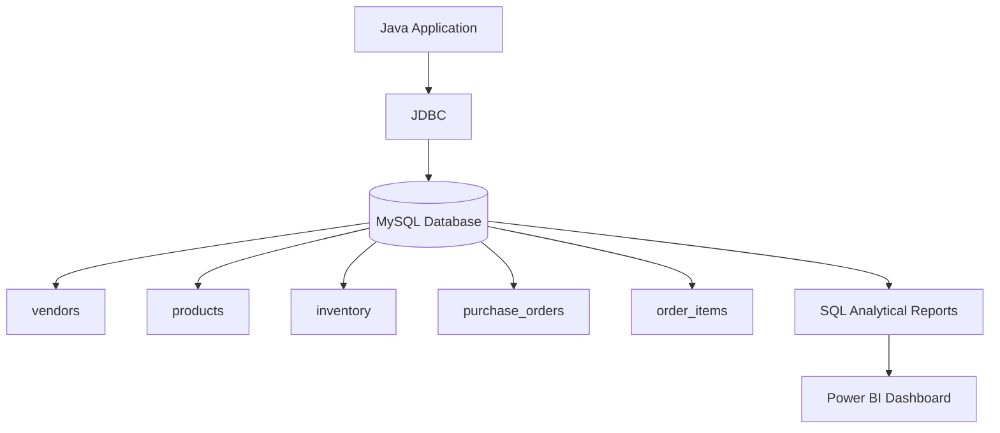
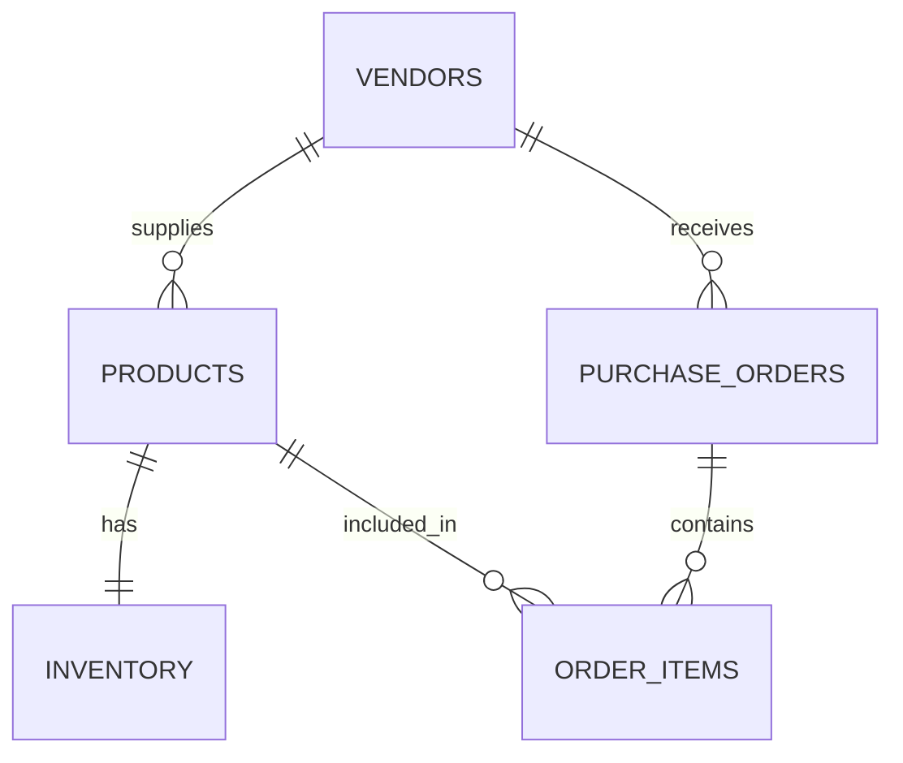
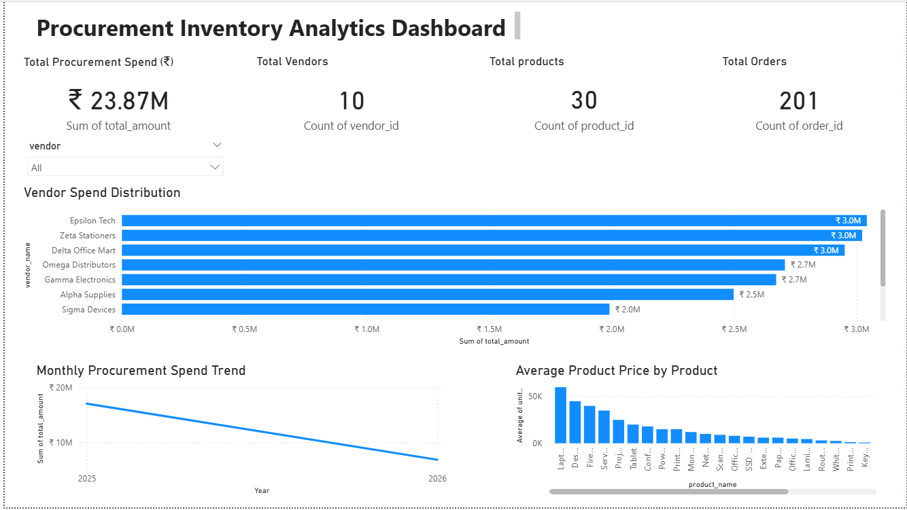

# Procurement / Inventory Management System

## Overview
This project is an end-to-end **Procurement and Inventory Analytics System** built using **Java (JDBC) and MySQL**.

It simulates a real-world procurement workflow including:

- Vendor management  
- Product cataloging  
- Inventory tracking  
- Purchase order processing  

The system is designed with a **fully normalized relational schema** and focuses on backend engineering principles such as:

- Data integrity  
- Transaction management  
- Analytical reporting  

---

## System Architecture



## System Design
The database consists of five core tables:

- vendors  
- products  
- inventory  
- purchase_orders  
- order_items  

The schema follows **Third Normal Form (3NF)** with proper foreign key relationships to ensure referential integrity.

Key relationships:

- **Products → Vendors** (many-to-one)  
- **Inventory → Products** (one-to-one)  
- **Purchase Orders → Vendors**  
- **Order Items → Products and Orders**

This structure ensures consistent data modeling and eliminates redundancy.

---

## Database Schema



## Dataset Scale
To simulate realistic business operations, synthetic data was generated programmatically.

The dataset currently includes:

- 10 vendors  
- 30 products  
- Inventory records for all products  
- 200+ purchase orders  
- 600+ order items  
- Approximately **6 months of transactional data**

All purchase order totals are calculated using:

```
total_amount = quantity × unit_price
```

This maintains logical consistency across the entire system.

---

## Transaction Management
Order placement is implemented using **manual transaction control in JDBC**.

The system uses:

- `setAutoCommit(false)`  
- `commit()`  
- `rollback()`  

Workflow:

1. A purchase order is created.
2. Inventory availability is checked.
3. Stock is deducted only if sufficient quantity exists.
4. If any validation fails, the transaction is rolled back.

This prevents:

- Partial order insertion  
- Incorrect stock updates  
- Data inconsistency  

The process demonstrates **ACID-compliant transaction management**.

---

## Analytical Reporting
The project includes advanced SQL reports built using:

- JOIN operations  
- Aggregations  
- Window functions  

Implemented reports include:

- Vendor spend analysis  
- Product demand ranking  
- Monthly purchase trends  
- Running cumulative spend  
- Low stock alerts  
- Vendor ranking using `RANK()`  
- Product demand ranking using `DENSE_RANK()`  
- Stock risk ranking  

These queries demonstrate strong SQL proficiency beyond basic CRUD operations.

---

## Power BI Procurement Dashboard

This project includes a Power BI dashboard for analyzing procurement data.

### Dashboard Features
- Total Procurement Spend KPI
- Vendor Spend Distribution
- Monthly Procurement Spend Trend
- Average Product Price Analysis
- Interactive Vendor Filter

### Dashboard Preview



### Power BI File
The dashboard file is available here:

procurement_inventory_dashboard.pbix

---

## Key Takeaways
This project demonstrates:

- Backend development using **Java and JDBC**
- **Normalized relational database design (3NF)**
- Transaction-safe order processing
- Advanced **SQL analytics with window functions**
- Synthetic dataset generation for realistic workflows
- Integration of backend systems with **Power BI dashboards**

Together, these components simulate a real-world **procurement and inventory analytics platform**.
